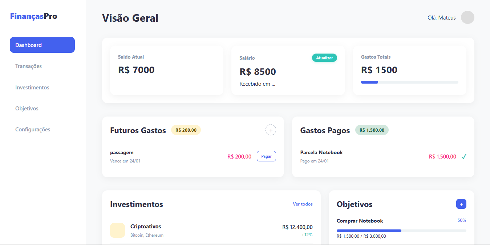
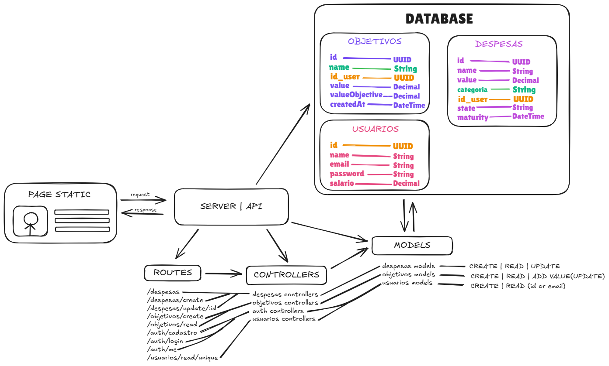

# 📊 Dashboard Financeiro — API & Arquitetura

Uma API RESTful moderna para um **Dashboard Financeiro**, projetada com foco em **organização, escalabilidade e boas práticas de arquitetura backend**. Este projeto serve como base sólida para aplicações financeiras pessoais ou SaaS, com autenticação, controle de despesas e objetivos financeiros.




---

## 🚀 Visão Geral

O sistema é composto por um **frontend estático desacoplado** que consome uma **API backend**, responsável por toda a lógica de negócio e persistência de dados.

A arquitetura segue princípios de **separação de responsabilidades**, facilitando manutenção, testes e evolução do sistema.

---

## 🧱 Arquitetura

### Visão Macro

```
Frontend (Página Estática)
        ↓ HTTP (JSON)
Server / API
        ↓
Routes → Controllers → Models → Database
```

### Padrões Utilizados

- Arquitetura em Camadas (Layered Architecture)
- MVC adaptado para API REST
- Repository Pattern (via Models)
- Frontend desacoplado do Backend

---

## 🗂️ Estrutura de Pastas (Backend)

```
server/
│
├── routes/           # Definição das rotas HTTP
├── controllers/      # Regras de negócio e orquestração
├── models/           # Acesso ao banco de dados
└── server.js
```

---

## 🗄️ Modelagem do Banco de Dados

### 👤 Usuários

| Campo    | Tipo    | Descrição                 |
| -------- | ------- | ------------------------- |
| id       | UUID    | Identificador único       |
| name     | String  | Nome do usuário           |
| email    | String  | Email (único)             |
| password | String  | Senha criptografada       |
| salario  | Decimal | Salário mensal do usuário |

---

### 💸 Despesas

| Campo     | Tipo     | Descrição                         |
| --------- | -------- | --------------------------------- |
| id        | UUID     | Identificador único               |
| name      | String   | Nome da despesa                   |
| value     | Decimal  | Valor da despesa                  |
| categoria | String   | Categoria (ex: aluguel, comida)   |
| state     | String   | Estado (pago, pendente, atrasado) |
| maturity  | DateTime | Data de vencimento                |
| id_user   | UUID     | Usuário proprietário              |

---

### 🎯 Objetivos Financeiros

| Campo          | Tipo     | Descrição             |
| -------------- | -------- | --------------------- |
| id             | UUID     | Identificador único   |
| name           | String   | Nome do objetivo      |
| value          | Decimal  | Valor atual acumulado |
| valueObjective | Decimal  | Meta financeira       |
| createdAt      | DateTime | Data de criação       |
| id_user        | UUID     | Usuário proprietário  |

---

## 🔐 Autenticação

O sistema utiliza **JWT (JSON Web Token)** para autenticação.

### Fluxo:

1. Cadastro do usuário
2. Login
3. Geração do token JWT
4. Token enviado via cookies ou headers
5. Middleware valida o token nas rotas protegidas

---

## 🌐 Rotas Principais

### Autenticação

- `POST /auth/cadastro`
- `POST /auth/login`
- `GET  /auth/me`

### Usuários

- `GET /usuarios/read/unique`

### Despesas

- `GET    /despesas`
- `POST   /despesas/create`
- `PATCH    /despesas/update/:id`

### Objetivos

- `GET  /objetivos/read`
- `POST /objetivos/create`

---

## 🧠 Models (Camada de Dados)

Cada domínio possui seu próprio model:

- `usuarios.models`
- `despesas.models`
- `objetivos.models`

Responsáveis por:

- Create
- Read
- Update
- Operações específicas (ex: adicionar valor ao objetivo)

---

## 🛠️ Tecnologias Utilizadas

- Node.js
- Express
- Prisma ORM
- JWT
- PostgreSQL / MySQL (configurável)
- JavaScript

---

## 📈 Possíveis Evoluções

- Versionamento da API (`/api/v1`)
- Camada de Services
- Validação de dados com Zod ou Joi
- Soft Delete
- Refresh Token
- Controle de permissões (RBAC)
- Logs e monitoramento

---

## 📌 Status do Projeto

🚧 Em desenvolvimento — base arquitetural finalizada e pronta para escalar.

---

## 🧑‍💻 Autor

**Mateus Barbosa**
Projeto desenvolvido para fins de estudo, portfólio e possível evolução para produto real.

---

Se você curte arquitetura limpa e backend bem estruturado, esse projeto é pra você. 🚀
